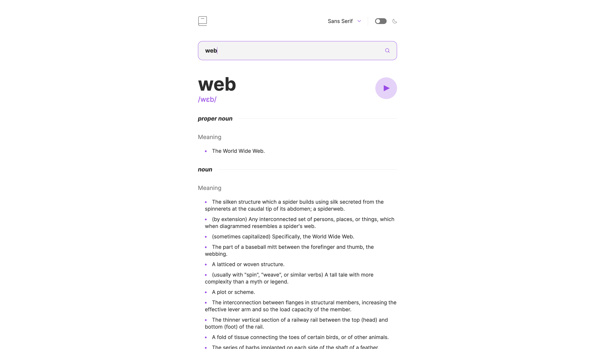
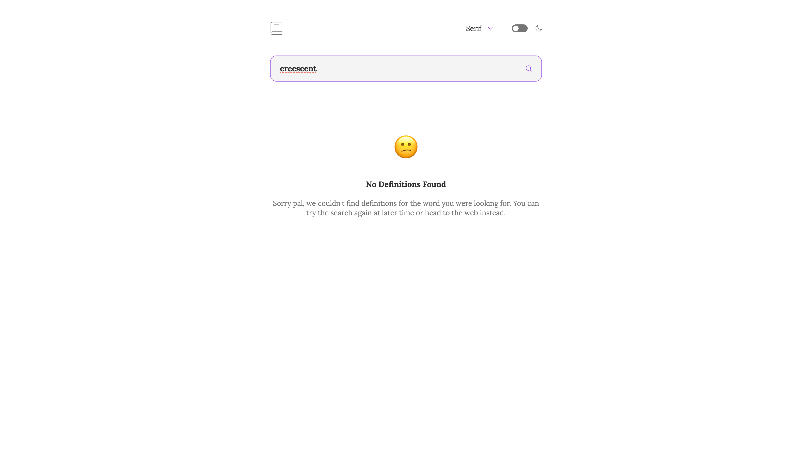

# Frontend Mentor - Dictionary web app solution

This is a solution to the [Dictionary web app challenge on Frontend Mentor](https://www.frontendmentor.io/challenges/dictionary-web-app-h5wwnyuKFL). Frontend Mentor challenges help you improve your coding skills by building realistic projects. 

## Table of contents

- [Overview](#overview)
  - [The challenge](#the-challenge)
  - [Screenshot](#screenshot)
  - [Links](#links)
- [My process](#my-process)
  - [Built with](#built-with)
  - [Continued development](#continued-development)
- [Author](#author)

**Note: Delete this note and update the table of contents based on what sections you keep.**

## Overview

### The challenge

Users should be able to:

- [x] Search for words using the input field
- [x] See the Free Dictionary API's response for the searched word
- [x] See a form validation message when trying to submit a blank form
- [x] Play the audio file for a word when it's available
- [x] Switch between serif, sans serif, and monospace fonts
- [x] Switch between light and dark themes
- [x] View the optimal layout for the interface depending on their device's screen size
- [x] See hover and focus states for all interactive elements on the page
- [ ]**Bonus**: Have the correct color scheme chosen for them based on their computer preferences. _Hint_: Research `prefers-color-scheme` in CSS.

### Screenshot

### Links

- Live Site URL: [https://jazzy-dodol-36cb47.netlify.app/](https://jazzy-dodol-36cb47.netlify.app/)

## My process

### Built with

- Semantic HTML5 markup
- Tailwindcss
- [React](https://reactjs.org/) - JS library

### Continued development

I started frontend mentor in order to get projects that would help me build out and understand how react components work especially around the hooks. I was finally able to gain __some__ understanding on how `useEffect` hook works but I still have a long way to go so I would continue to focus on that.

## Author

- Frontend Mentor - [@adetola-ralph](https://www.frontendmentor.io/profile/adetola-ralph)
